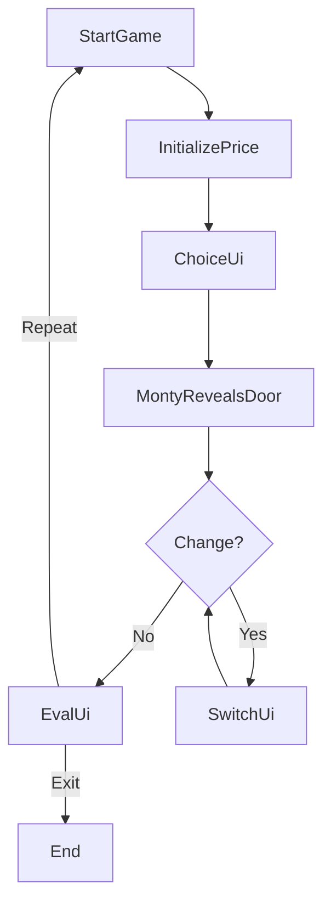

# Monti Hall Logic Flowchart

```mermaid
flowchart TD;
    StartGame --> InitializePrice
    InitializePrice --> ChoiceUi
    ChoiceUi --> MontyRevealsDoor
    MontyRevealsDoor --> ChangeDecision{Change?}
    ChangeDecision -->|No| EvalUi
    ChangeDecision -->|Yes| SwitchUi
    SwitchUi --> ChangeDecision
    EvalUi -->|Repeat| StartGame
    EvalUi -->|Exit| End
```